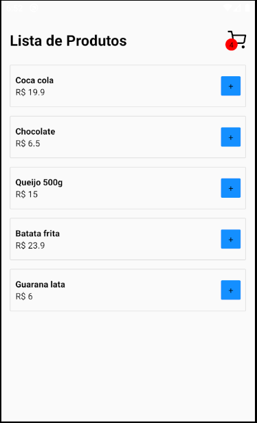

  <h1>App carrinho de compras</h1>

  

Aplicativo carrinho de compras com React Native

## ✔️ Técnicas e tecnologias utilizadas

Lista de tecnologias que foram usadas nesse projeto:

### 📚 Outras bibliotecas utilizadas

1. [React Navigation](https://reactnavigation.org/)
2. [Vector Icons](https://github.com/oblador/react-native-vector-icons)

## 🛠️ Abrir e rodar o projeto

Para abrir e rodar o projeto, entre na pasta do projeto e execute `expo install` para instalar as dependências e `expo start` para iniciar o projeto.

## 📚 Mais informações

Entre em contato pelo [linkedin](https://www.linkedin.com/in/grazziano-fagundes/).

  <small>Grazziano Borges Fagundes - 2023</small>

